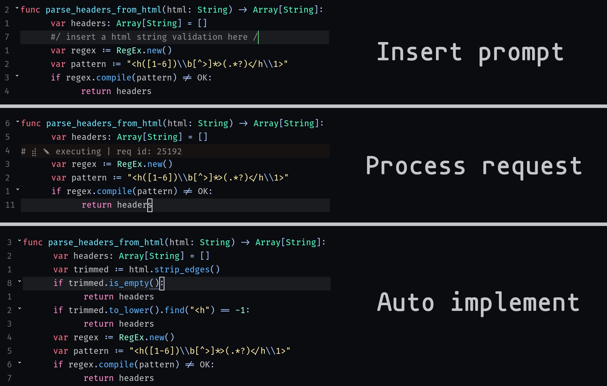
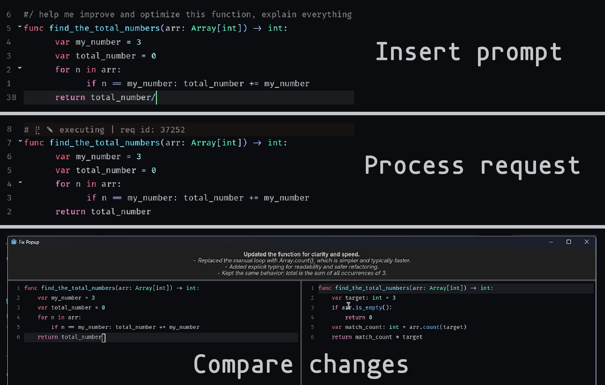

# Godex CLI

[View the DEMO video here with setup instructions and examples](https://youtu.be/lgm5tGClW2w)

Improved version of Godex.
Integrate the OpenAI Codex CLI directly into the Godot editor. This plugin lets you ask questions, insert code, and request fixes **from inside the Script Editor**, using a locally installed Codex CLI (no API key in the plugin).
This plugis in **NOT BUILT** for vibe coding, don't let it create your whole project!! It only has permissions to read files, inserting code and writing to the editor is handled manually by the plugin for more fine-grained control.

---

## Features

- **ASK**: ask questions about your project and get answers in-editor.
- **INSERT**: generate code at a specific cursor location.
- **FIX**: select a block and ask Codex to refactor or correct it.
- **In‑editor output**: results show up in the editor and (for FIX/ASK) a popup with a preview.
- **Context**: has full project context and read access, and remembers conversations.
- **Customizing**: easily change the behavior, formatting and skills that Godex respects.

---

## Requirements

- Godot **4.5+**
- **OpenAI Codex CLI** installed on your machine
- Terminal access from your OS PATH

---

## Install

1. Copy this plugin folder into your project, or use the asset library within the Godot engine:

```
res://addons/godex-cli/
```

2. Enable it in **Project → Project Settings → Plugins**.

---

## Install & Configure Codex CLI

> This plugin calls the `codex` CLI executable under the hood.

1. Install the Codex CLI ([follow OpenAI’s official instructions](https://developers.openai.com/codex/cli)):

```
npm i -g @openai/codex
# make sure you check out the official codex guidelines
```


2. Verify it works:

```
codex --version
```

3. Make sure your OpenAI account is authenticated for the CLI.

---

## Configure Context Files

The plugin reads a folder of context instructions and prepends them to every prompt.

- Default location:

```
res://addons/godex-cli/context/
```

- You can change it via:

```
Editor Settings → GodexCLI/context_dir
```

Any Markdown files in that folder can be used to control formatting, behavior, and response schema.

---

## Configure Context Memory

The plugin will store its last session ID and resume where you left off. This is on a per-project basis.
You can share a session ID over multiple projects if they overlap.

- You can find and load a key via:

```
Project Settings → GodexCLI/session_id
```

---

## How to Use (Examples)

### 1) ASK (Question)
Type a question at your cursor with the **ASK syntax** "#(~)#":

```gdscript
#( How can I cache a JSON file in Godot? )#
```

The plugin removes the line and displays the answer in the editor output.
When you ask for examples, it will use a popup window to show the code example.


---

### 2) INSERT (Generate code at cursor)
Use the **INSERT syntax** "#/~/#" to generate code at the current line:

```gdscript
#/ Create a simple player movement function for a CharacterBody2D /#
```

Godex will return a code block and the plugin inserts it at the marked line.



---

### 3) FIX (Refactor or analyze a block)
Wrap a block with **FIX markers** "#/~/#" and a prompt:

```gdscript
#/ improve the error handling and explain the logic
func _process(delta: float) -> void:
	... your code ...
/#
```

Godex returns a suggested rewrite or analysis. A popup window lets you compare, make changes and accept it.



---

## Output Behavior

- **INSERT**: replaces the marker line with generated code.
- **FIX**: opens a review popup with old + new code.
- **ASK**: opens a popup if a code sample is returned, otherwise prints text.

---

## Troubleshooting

**The plugin does nothing / no response**
- Make sure `codex` is on your PATH.
- Check the Godot output panel for process errors.

---

## Project Structure

```
addons/godex-cli/
├── context/
│   └── main.md
├── scenes/
│   ├── fix_window.gd
│   └── fix_window.tscn
├── godex-cli-main.gd
├── plugin.cfg
└── godex-cli-main.gd.uid
```

---

## Roadmap

- Better error surfacing in UI
- Session history
- More robust JSON parsing / buffered output handling
- Custom hotkeys for ASK/INSERT/FIX
- Extra functionality
- Optional custom hooks and prompts

---

## Credits

Created by **Ben Heirbaut**.

---

## License

MIT